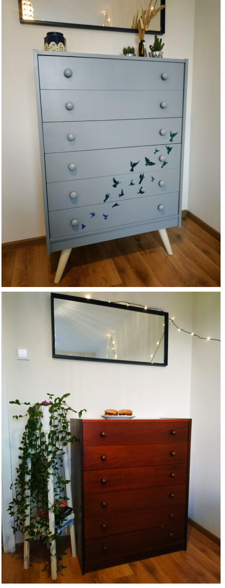

# _Stāsts par mani_

Vispār esmu piektais eneagrammas tips, kurš visu laiku tiecas maciīties, bet neizskaidrojamu iemeslu dēļ ne visai vēlas dalīties ar iegūtajām zināšanām. Noteikti sevi pieskaitu pie intovertā tipa, jo izbaudu vienpatību, bet nepieciešamības gadījumā nav problēmu arī uzvesties kā absolūtam ekstrovertam.

Es mācījos vidusskolā Rīgā, bet studēju Ventspilī un Tībingenā (Vācija). Es tiecos nepārtraukti mainīt vidi sev apkārt, tāpēc arī izvēlējos mācīties vēl nepazīstamās vidēs. Jo pielāgošanās jaunajai videi sniedz gandrīz līdzvērtīgu ieguvumu apgūstamajām zināšanām vidusskolā un augstskolā.
Vieni no maniem pēdējiem sevis izaicinājumiem bija iegūt maģistra grādu Vācijas universitatē astronomijas un astrofizikas studiju programmā, kā arī pēcāk nomainīt nodarbošanās vizienu, kļūstot par testētāju.

Aptuveni desmit gadus es spēlēju volejbolu, kas visu šo laiku bija viena no manām sirdslietām. Traumas dēļ to pārtraucu un sāku apgūt jogu un vairāk interesēties par mākslu, konkrēti, interjera dizainu un dažādiem radošiem rokdarbiem, kā mēbeļu pārveidošana. Viens no šādiem projektiem bija kumodes pārveidošana. 

Man ļoti patīk lasīt grāmatas, kas raisa pārdomas. Vienas no manām mīļākajām grāmatām ir:
- Džordžs Orvels: [1984](https://www.goodreads.com/book/show/40961427-1984);
- Eva Vīvere: [The Puppet Boy Of Warsaw](https://www.goodreads.com/book/show/17202380-the-puppet-boy-of-warsaw).

Šobrīd pavadu pusi sava laika Rīgā un otru pusi Aizputē, kur lielākoties atrodos pie dabas, piemēram, peldoties visu gadu.